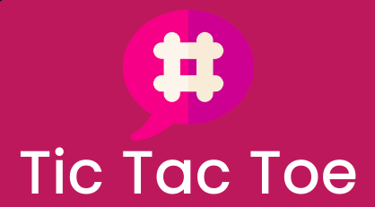

# Mini Tic-Tac-Toe

## About

### Mini Tic-Tac-Toe is a socket based, 2-player game with in-game chat functionality and an amazing UI.

#### Try it on: [https://mini-tic-tac-toe.vercel.app](https://mini-tic-tac-toe.vercel.app)

#### Tech Stack: Socket.io, Express JS, React JS, Tailwind CSS

## Features
* Blazing fast response
* Responsive UI (looks awesome on all devices)
* Smart lobby management
* In-Game chat

## Screenshots

